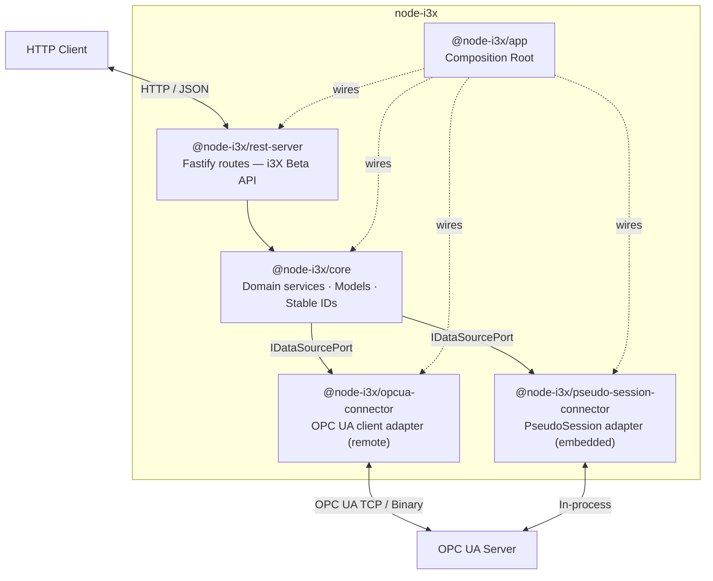

# node-i3x

> TypeScript implementation of the i3X Beta specification — bridging OPC UA industrial automation to a modern REST API

<!-- Badges -->


---

## Overview

**node-i3x** converts OPC UA address spaces into [i3X](https://i3x.dev)-compliant REST/JSON endpoints. It exposes industrial automation data through a clean HTTP API with:

- **Stable element IDs** — deterministic, namespace-URI-based identifiers that survive server restarts
- **Real-time subscriptions** — long-poll and Server-Sent Events (SSE) for live value updates
- **Historical data access** — query time-series history for any monitored variable
- **Two connector modes** — connect to a remote OPC UA server over TCP, or embed one in-process with zero network overhead

Built with [node-opcua](https://node-opcua.github.io/), [Fastify](https://fastify.dev/), and a hexagonal (ports & adapters) architecture.

---

## Architecture



### Hexagonal Layers

```
┌─────────────────────────────────────────────────────────┐
│                     @node-i3x/app                       │
│               (Composition Root / Wiring)               │
│                                                         │
│  ┌─────────────────────┐   ┌──────────────────────────┐ │
│  │ @node-i3x/rest-server│   │ @node-i3x/opcua-connector│ │
│  │   Fastify routes     │   │   node-opcua client      │ │
│  │   INBOUND ADAPTER    │   │   OUTBOUND ADAPTER       │ │
│  └──────────┬──────────┘   └─────────────┬───────────┘ │
│             │  uses ports       implements│  ports      │
│             ▼                             ▼             │
│  ┌─────────────────────────────────────────────────────┐│
│  │                  @node-i3x/core                     ││
│  │    Domain Models · Services · Port Interfaces       ││
│  │                 ZERO DEPENDENCIES                   ││
│  └─────────────────────────────────────────────────────┘│
└─────────────────────────────────────────────────────────┘
```

---

## Packages

| Package | Description | Status |
|---------|-------------|--------|
| [`@node-i3x/core`](./packages/core) | Domain core: models, ports (`IDataSourcePort`, `ILogger`), services (`ModelService`, `ValueService`, `HistoryService`, `SubscriptionService`), stable ID mapper | ✅ Stable |
| [`@node-i3x/opcua-connector`](./packages/opcua-connector) | OPC UA client adapter — implements `IDataSourcePort` using `node-opcua` (remote TCP/binary transport) | ✅ Stable |
| [`@node-i3x/pseudo-session-connector`](./packages/pseudo-session-connector) | PseudoSession adapter — implements `IDataSourcePort` using `node-opcua` PseudoSession (embedded in-process, zero network) | ✅ Stable |
| [`@node-i3x/rest-server`](./packages/rest-server) | Fastify REST routes implementing the i3X Beta API surface | ✅ Stable |
| [`@node-i3x/app`](./packages/app) | Composition root — wires all packages together, entry point | ✅ Stable |
| [`@node-i3x/demo-embedded`](./packages/demo-embedded) | Embedded demo with live dashboard — OPC UA server + i3X API wired via PseudoSession | 🧪 Demo |

---

## Quick Start

```bash
# Clone the repository
git clone https://github.com/sterfive/node-i3x.git
cd node-i3x

# Install dependencies
npm install

# Configure environment
cp .env.example .env
# Edit .env — set NODE_I3X_OPCUA_ENDPOINT to your OPC UA server

# Start in development mode (remote OPC UA)
npm run dev

# Or run the embedded demo (no external OPC UA server needed)
npm run demo -w packages/demo-embedded
```

The server starts on `http://127.0.0.1:8000` by default. Verify with:

```bash
curl http://127.0.0.1:8000/health
# → { "status": "ok" }
```

---

## Configuration

All configuration is via environment variables (or `.env` file):

| Variable | Default | Description |
|----------|---------|-------------|
| `NODE_I3X_OPCUA_ENDPOINT` | `opc.tcp://localhost:4840` | OPC UA server endpoint URL |
| `NODE_I3X_OPCUA_SECURITY_MODE` | `None` | Security mode (`None`, `Sign`, `SignAndEncrypt`) |
| `NODE_I3X_OPCUA_OPTIMIZED_CLIENT` | `auto` | `auto` = detect @sterfive module, `disabled` = skip |
| `NODE_I3X_PRELOAD` | `true` | Preload the OPC UA model on startup |
| `NODE_I3X_PRELOAD_STRICT` | `false` | Exit if model preload fails |
| `NODE_I3X_PUBLISH_INTERVAL` | `5` | Subscription polling interval |
| `NODE_I3X_PORT` | `8000` | HTTP server port |
| `NODE_I3X_HOST` | `127.0.0.1` | HTTP server bind address |
| `NODE_I3X_LOG_LEVEL` | `info` | Log level (`debug`, `info`, `warn`, `error`) |

---

## Development

```bash
# Run all tests (vitest)
npm test

# Run tests in watch mode
npm run test:watch

# TypeScript type checking
npm run typecheck

# Lint + format check (Biome)
npm run lint

# Auto-fix lint and format issues
npm run lint:fix

# Build all packages (tsup — minified ESM + .d.ts)
npm run build
```

### Tech Stack

| Tool | Purpose |
|------|---------|
| [TypeScript](https://www.typescriptlang.org/) | Language (ESM-only) |
| [tsup](https://tsup.egoist.dev/) | Build (esbuild, minified ESM + `.d.ts`) |
| [Vitest](https://vitest.dev/) | Testing |
| [Biome](https://biomejs.dev/) | Lint + Format |
| [Fastify](https://fastify.dev/) | HTTP framework |
| [node-opcua](https://node-opcua.github.io/) | OPC UA client SDK |

---

## Key Concepts

### 🔑 Stable Element IDs

OPC UA `NodeId` values are volatile — namespace indices can shuffle across server restarts. node-i3x generates **stable, deterministic element IDs** by:

1. Computing the full **namespace-URI browse path** for each node (e.g., `nsu=http://example.org;s=Sensor1/Temperature`)
2. Hashing the path with a deterministic hash function
3. Producing a fixed-length hex ID that remains constant regardless of namespace index changes

This ensures that REST clients can bookmark and cache element IDs across server lifecycles.

### 🔷 Hexagonal Architecture (Ports & Adapters)

The codebase follows a strict **hexagonal / ports & adapters** pattern:

- **`@node-i3x/core`** defines domain models and **port interfaces** (`IDataSourcePort`, `ILogger`) with zero external dependencies
- **Outbound adapters** (`opcua-connector`, `pseudo-session-connector`) implement `IDataSourcePort`
- **Inbound adapter** (`rest-server`) translates HTTP requests into domain service calls
- **`@node-i3x/app`** is the composition root that wires adapters to ports

### 🔌 Two Connector Modes

| Mode | Package | Transport | Use Case |
|------|---------|-----------|----------|
| **Remote** | `@node-i3x/opcua-connector` | OPC UA TCP/Binary | Connect to any standard OPC UA server on the network |
| **Embedded** | `@node-i3x/pseudo-session-connector` | In-process (zero network) | Run an OPC UA server and the i3X API in the same process — ideal for demos, testing, and edge deployments |

---

## API Endpoints

The i3X Beta REST API surface:

### System

| Method | Endpoint | Description |
|--------|----------|-------------|
| `GET` | `/health` | Health check |
| `GET` | `/ready` | Readiness check (data source connected?) |
| `GET` | `/v1/info` | Server info, spec version, capabilities |

### Namespaces

| Method | Endpoint | Description |
|--------|----------|-------------|
| `GET` | `/v1/namespaces` | List all OPC UA namespaces |

### Objects

| Method | Endpoint | Description |
|--------|----------|-------------|
| `GET` | `/v1/objects` | List all objects (optional: `?root=true`, `?typeElementId=...`) |
| `POST` | `/v1/objects/list` | Bulk-fetch objects by element IDs |
| `POST` | `/v1/objects/value` | Bulk-read current values |
| `POST` | `/v1/objects/related` | Bulk-fetch related objects (children / parent) |
| `POST` | `/v1/objects/history` | Bulk-read historical values |
| `PUT` | `/v1/objects/:elementId/value` | Write a value to a single element |

### Object Types

| Method | Endpoint | Description |
|--------|----------|-------------|
| `GET` | `/v1/objecttypes` | List all object types (optional: `?namespaceUri=...`) |

### Relationship Types

| Method | Endpoint | Description |
|--------|----------|-------------|
| `GET` | `/v1/relationshiptypes` | List relationship types *(stub — 501)* |

### Subscriptions

| Method | Endpoint | Description |
|--------|----------|-------------|
| `POST` | `/v1/subscriptions` | Create a new subscription |
| `POST` | `/v1/subscriptions/register` | Register element IDs for monitoring |
| `POST` | `/v1/subscriptions/unregister` | Unregister element IDs |
| `POST` | `/v1/subscriptions/sync` | Poll for value updates (long-poll) |
| `POST` | `/v1/subscriptions/stream` | Stream value updates via SSE |
| `POST` | `/v1/subscriptions/list` | List subscription details |
| `POST` | `/v1/subscriptions/delete` | Delete subscriptions |

> 📘 Full OpenAPI specification: [`openapi.json`](./openapi.json)

---

## Docker

```bash
docker build -t node-i3x .
docker run -p 8000:8000 \
  -e NODE_I3X_OPCUA_ENDPOINT=opc.tcp://host.docker.internal:4840 \
  node-i3x
```

---

## 🚀 @sterfive/opcua-optimized-client

For production deployments, install the optional **[@sterfive/opcua-optimized-client](https://support.sterfive.com)** module for up to **200% performance improvement**:

- Intelligent transaction batching
- Automatic server-limit handling
- Advanced auto-healing connection logic

The module is detected automatically at startup — no code changes needed. It is listed as an `optionalDependency` in `@node-i3x/opcua-connector`.

> Contact [Sterfive Support](https://support.sterfive.com) for access.

---

## i3X Specification

- **Official site**: [https://i3x.dev](https://i3x.dev)
- **GitHub**: [https://github.com/cesmii/i3X](https://github.com/cesmii/i3X)
- **CESMII**: [https://cesmii.org](https://cesmii.org)

---

## License

This project is dual-licensed:

| License | Use Case |
|---------|----------|
| **[AGPL-3.0-or-later](https://www.gnu.org/licenses/agpl-3.0.html)** | Open-source use — you must share your source code if you deploy this as a network service |
| **[Commercial](https://sterfive.com)** | Proprietary / closed-source use — no copyleft obligations |

> **The AGPL-3.0 restrictions can be lifted by acquiring a commercial
> license at [sterfive.com](https://sterfive.com).**
>
> Contact [contact@sterfive.com](mailto:contact@sterfive.com) for
> pricing and terms.

See [LICENSE](./LICENSE) for full details.

---

## Credits

Built by [Sterfive](https://sterfive.com) — Industrial-grade OPC UA solutions for the modern web.

<p align="center">
  <a href="https://sterfive.com">
    <strong>sterfive.com</strong>
  </a>
</p>
