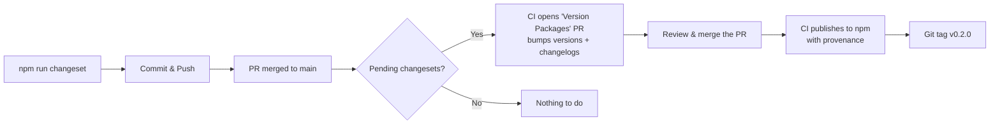

# Releasing node-i3x

This project uses [Changesets](https://github.com/changesets/changesets) for
version management and automated npm publishing with
[provenance attestation](https://docs.npmjs.com/generating-provenance-statements).

## How It Works

```
Developer adds changeset → PR merged → CI creates "Version Packages" PR
                                       → Merge that PR → CI publishes to npm
```



## Day-to-Day Workflow

### 1. Add a Changeset

After making a change that should trigger a version bump:

```bash
npm run changeset
```

This interactive CLI asks:
- **Which packages changed?** — select the affected packages
- **Bump type?** — `patch` (bug fix), `minor` (feature), `major` (breaking)
- **Summary** — one-line description for the changelog

It creates a markdown file in `.changeset/` (e.g.,
`.changeset/happy-fish-dance.md`):

```markdown
---
"@node-i3x/core": minor
"@node-i3x/opcua-connector": minor
"@node-i3x/rest-server": minor
"@node-i3x/pseudo-session-connector": minor
---

Add vendor metadata to /v1/info endpoint
```

> **Note**: All 4 publishable packages use **fixed versioning** —
> they always share the same version number. Bumping one bumps all.

### 2. Commit the Changeset

```bash
git add .changeset/
git commit -m "chore: add changeset for feature X"
git push
```

### 3. The CI Takes Over

When your PR is merged to `main`, the
[release workflow](/.github/workflows/release.yml) runs:

1. **If there are pending changesets** — the CI creates (or updates) a
   PR titled **"chore: version packages"** that:
   - Bumps `version` in all `package.json` files
   - Updates `CHANGELOG.md` in each package
   - Removes consumed `.changeset/*.md` files

2. **When you merge that PR** — the CI:
   - Runs `npm run build` (tsup)
   - Publishes all packages to npm with `--provenance`
   - Creates a git tag `v0.2.0`

### 4. Verify on npm

After publishing, verify:

```bash
npm info @node-i3x/core
```

The package will show:
- ✅ **Provenance** badge on npmjs.com (built from this repo)
- ✅ Correct version
- ✅ All files (dist/, LICENSE, LICENSING.md, README.md)

---

## Manual Release (Local)

If you need to release manually (e.g., first release):

```bash
# 1. Add a changeset
npm run changeset

# 2. Apply version bumps + generate changelogs
npm run version-packages

# 3. Review the changes
git diff

# 4. Commit
git add -A
git commit -m "chore: version packages v0.1.0"

# 5. Build and publish
npm run build
npm publish -w packages/core
npm publish -w packages/opcua-connector
npm publish -w packages/pseudo-session-connector
npm publish -w packages/rest-server

# 6. Tag and push
git tag v0.1.0
git push origin main --tags
git push gitlab main --tags
```

---

## npm Trusted Publishing (OIDC) Setup

This project uses **npm Trusted Publishing** — no `NPM_TOKEN` secret needed.
GitHub Actions authenticates directly with npm via OIDC.

### One-time setup on npmjs.com

For each package (`@node-i3x/core`, `@node-i3x/opcua-connector`,
`@node-i3x/pseudo-session-connector`, `@node-i3x/rest-server`):

1. Go to [npmjs.com](https://www.npmjs.com) → sign in
2. Navigate to the package → **Settings** → **Publishing access**
3. Under **Trusted Publishers**, click **Add**:
   - **Provider**: GitHub Actions
   - **Repository owner**: `node-opcua`
   - **Repository name**: `node-i3x`
   - **Workflow filename**: `release.yml`
   - **Environment**: *(leave empty)*
4. Save

### GitHub Secrets

| Secret | Purpose | Required? |
|--------|---------|:---------:|
| `GITHUB_TOKEN` | PR creation + git push | Built-in, automatic |
| `NPM_STERFIVE_TOKEN` | Private @sterfive registry | Optional — for `@sterfive/opcua-optimized-client` |

> **Note**: No `NPM_TOKEN` is needed — the `id-token: write` permission
> in the workflow enables OIDC-based authentication with npm.

---

## Version Strategy

### Fixed Versioning

All 4 publishable packages always share the same version:

```
@node-i3x/core                       → 0.2.0
@node-i3x/opcua-connector            → 0.2.0
@node-i3x/pseudo-session-connector   → 0.2.0
@node-i3x/rest-server                → 0.2.0
```

This is configured in `.changeset/config.json` via the `"fixed"` array.

### Private Packages (not published)

- `@node-i3x/app` — composition root
- `@node-i3x/demo-embedded` — demo

These are in the `"ignore"` list and never published to npm.

### Semver Convention

| Bump | When | Example |
|------|------|---------|
| `patch` | Bug fixes, docs, internal refactors | `0.1.0 → 0.1.1` |
| `minor` | New features, new endpoints, non-breaking additions | `0.1.0 → 0.2.0` |
| `major` | Breaking API changes, removed endpoints | `0.2.0 → 1.0.0` |

---

## npm Provenance

All packages are published with
[provenance attestation](https://docs.npmjs.com/generating-provenance-statements),
configured via `publishConfig.provenance: true` in each `package.json`.

This means npmjs.com shows:
- ✅ Which GitHub repo the package was built from
- ✅ Which commit and workflow produced the build
- ✅ A signed SLSA provenance certificate

This is important for supply chain security and builds trust with users.
