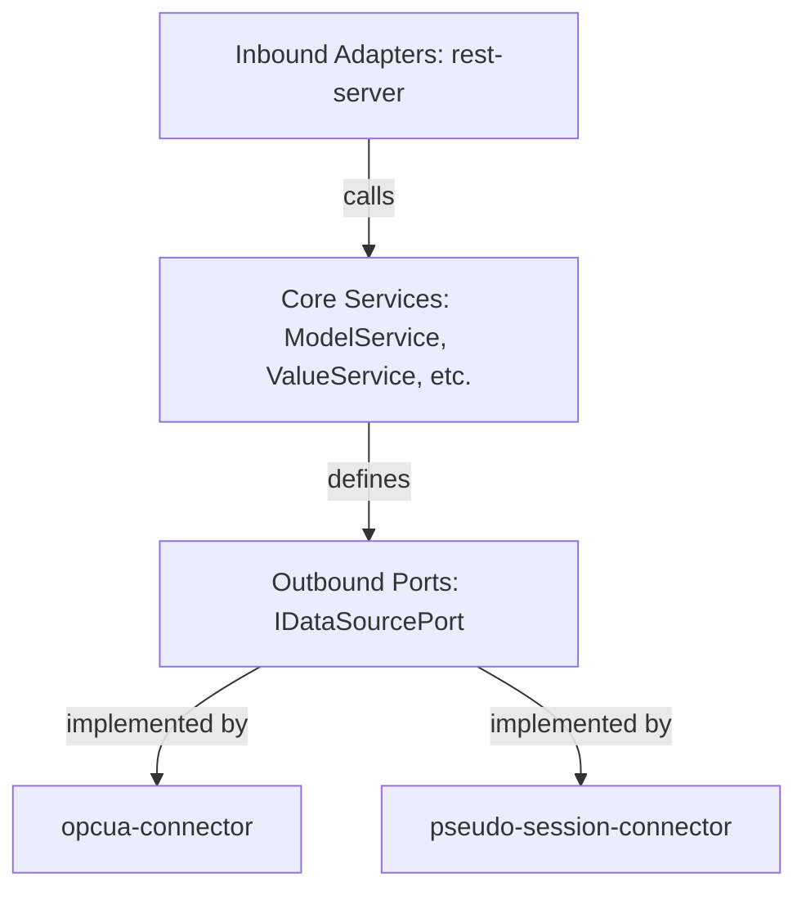

# ADR 001: Hexagonal Architecture (Ports & Adapters)

## Status
Approved

## Context
The `node-i3x` server acts as a bridge, reading from industrial OPC UA servers (outbound data source) and exposing a standardized i3X REST API (inbound interface) along with high-performance subscription polling.
To ensure maintainability, testability, and decoupling of protocol details from domain model translation, we need a clean separation of concerns.

## Decision
We adopt Hexagonal Architecture (Ports & Adapters) across the monorepo packages:
1. **Core Domain (`@node-i3x/core`)**: Contains the pure domain models (`ModelNode`), domain logic (like value normalization, sync queue management), and interfaces (ports) defining how the domain interacts with the outside world:
   - `IDataSourcePort` (Outbound Port): Defines how to query object models, read/write values, read history, and monitor items.
   - `ILogger` (Outbound Port): Defines standard logging methods.
2. **Outbound Adapters**: Implement `IDataSourcePort` to talk to OPC UA:
   - `@node-i3x/opcua-connector`: Implements connection to a real remote OPC UA server.
   - `@node-i3x/pseudo-session-connector`: Implements connection directly to an in-memory OPC UA `AddressSpace` without network calls.
3. **Inbound Adapters**: Expose interfaces to external clients:
   - `@node-i3x/rest-server`: Fastify-based REST server translating HTTP requests into calls on domain services (`ModelService`, `ValueService`, `HistoryService`, `SubscriptionService`, `TypeService`).
4. **App Entrypoint (`@node-i3x/app`)**: Resolves config, instantiates the adapter and services, and wires them together.

## Consequences
- **High Testability**: Core services can be comprehensively tested using a simple in-memory mock implementation of `IDataSourcePort` without needing a running network OPC UA server.
- **Flexibility**: We can easily run the server in a network-free embedded mode (e.g. `demo-embedded`) using the `pseudo-session-connector` interacting directly with an address space in the same process.
- **Decoupled Dependencies**: Third-party framework details (Fastify, commander, node-opcua) do not leak into core logic.
