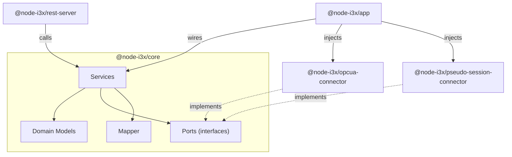
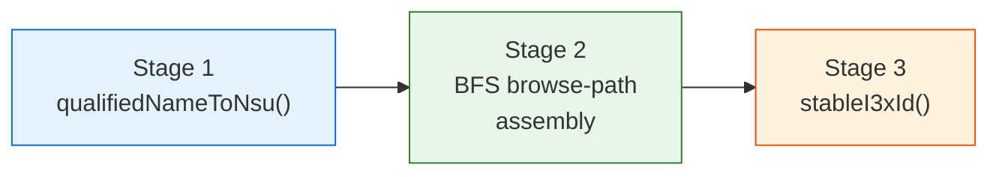

# @node-i3x/core

[](https://www.typescriptlang.org/)
[](https://nodejs.org/)
[](#license)
[](#)

> Domain core for the i3X specification — models, ports, and services with zero runtime dependencies.

`@node-i3x/core` is the pure domain layer of the **node-i3x** monorepo. It defines every domain model, service, and port interface required by the i3X Beta REST API — without importing a single runtime dependency. Adapters (OPC UA, MQTT, mock …) plug into the ports; the composition root wires everything together.

---

## Installation

```bash
npm install @node-i3x/core
```

> **Private registry** — this package is published to the `@sterfive` scope on `npm-registry.sterfive.fr`. Make sure your `.npmrc` is configured accordingly.

---

## Architecture

This package follows **hexagonal architecture** (ports & adapters). The domain owns the business logic and exposes well-defined port interfaces; concrete infrastructure is always injected from the outside.



### Domain Models

| Type | File | Description |
|------|------|-------------|
| `ModelNode` | `domain/model-node.ts` | A single node in the i3X model tree (id, name, kind, children, sourceNodeId) |
| `BuildResult` | `domain/model-node.ts` | Fully-resolved model snapshot with lookup maps |
| `NodeKind` | `domain/model-node.ts` | `'asset' \| 'property' \| 'action' \| 'eventSource'` |
| `DataQuality` | `domain/model-node.ts` | `'Good' \| 'GoodNoData' \| 'Bad' \| 'Uncertain'` |
| `VQT` | `domain/vqt.ts` | Value / Quality / Timestamp — the universal data-exchange atom |
| `CurrentValueResult` | `domain/vqt.ts` | VQT with optional composition components |
| `HistoricalValueResult` | `domain/vqt.ts` | Array of historical VQT entries |
| `Subscription*` | `domain/subscription.ts` | `SubscriptionUpdate`, `SubscriptionDetail`, `SubscriptionDeleteResult`, `CreateSubscriptionOptions`, … |

### Ports (Interfaces)

Ports are the hexagonal boundary — domain services call them; adapters implement them.

#### `IDataSourcePort`

The single contract between the domain and any data source:

```typescript
interface IDataSourcePort {
  // Lifecycle
  connect(): Promise<void>;
  disconnect(): Promise<void>;
  isConnected(): boolean;

  // Model discovery
  browseTree(): Promise<SourceNodeInfo[]>;
  getNamespaces(): Promise<NamespaceInfo[]>;
  getObjectTypes(): Promise<ObjectTypeInfo[]>;

  // Value operations
  readValue(sourceNodeId: string): Promise<SourceDataValue>;
  readValues(sourceNodeIds: string[]): Promise<SourceDataValue[]>;
  writeValue(sourceNodeId: string, value: unknown): Promise<void>;

  // History
  readHistory(sourceNodeId: string, startTime: Date, endTime: Date): Promise<SourceHistoricalValue[]>;

  // Subscriptions
  createMonitoredSubscription(options: MonitoredSubscriptionOptions): Promise<IMonitoredSubscription>;
}
```

#### `ILogger`

Minimal logging port so the domain never depends on pino / winston / console:

```typescript
interface ILogger {
  debug(msg: string, ...args: unknown[]): void;
  info(msg: string, ...args: unknown[]): void;
  warn(msg: string, ...args: unknown[]): void;
  error(msg: string, ...args: unknown[]): void;
}
```

Two built-in implementations are provided: `nullLogger` (silent) and `consoleLogger` (delegates to `console.*`).

### Services

| Service | Responsibility |
|---------|---------------|
| **`ModelService`** | BFS tree walker + stable ID generator. Browses the source address space, builds namespace-URI browse paths, and projects every source node into a `ModelNode` with a deterministic `stableI3xId`. Caches the `BuildResult` in memory. |
| **`ValueService`** | Read / write with batch optimisation. Classifies requested elements into leaves vs. composites, batch-reads all leaf property values in a single `readValues()` call, then recursively assembles composite results. |
| **`HistoryService`** | Historical value reads. Resolves element IDs to source node IDs and delegates to `IDataSourcePort.readHistory()` with parallel execution. |
| **`SubscriptionService`** | Real-time composite subscriptions with debouncing. Manages per-asset VQT caches, fans out source-level data-change callbacks to all registered assets, debounces updates (200 ms window), and delivers composite `CurrentValueResult` snapshots via a long-poll / streaming queue. Falls back to polling if native subscriptions are unavailable. |

### Mapper

Pure functions for ID generation and node projection:

| Function | Signature | Purpose |
|----------|-----------|---------|
| `stableI3xId` | `(browsePath: string, kind: NodeKind) → string` | Deterministic SHA-1 hash from browse path, prefixed with kind |
| `inferKind` | `(node: SourceNodeInfo) → NodeKind` | Maps OPC UA node class → i3X kind |
| `mapNode` | `(node, childIds, browsePath) → ModelNode` | Projects a source node into a domain ModelNode |
| `mapType` | `(node, kind) → string \| null` | Extracts type definition for property nodes |

---

## Key Concept: Stable Element IDs

OPC UA `NodeId` values contain a **namespace index** (`ns=2;i=1234`) that is volatile — the server assigns indices at startup, and they can shuffle across restarts. The i3X specification requires **stable, deterministic element IDs** that survive these changes.

`@node-i3x/core` solves this with a **3-stage pipeline**:



### Stage 1 — Namespace-URI qualification

Each node's browse name is converted from the volatile `ns` index form to a stable URI form:

```
ns=2;BrowseName=Temperature  →  nsu=http://example.com/UA/:Temperature
```

The `nsuQualifiedName` field on `SourceNodeInfo` carries this stable segment.

### Stage 2 — BFS browse-path assembly

Starting from the address-space roots, a breadth-first traversal concatenates `nsuQualifiedName` segments into a full browse path:

```
nsu=http://opcfoundation.org/UA/DI/:DeviceSet/nsu=http://example.com/UA/:Pump/nsu=http://example.com/UA/:Temperature
```

This path is **globally unique** and **namespace-index-independent**.

### Stage 3 — Deterministic hashing

`stableI3xId()` hashes the full browse path with SHA-1 and prefixes the result with the node's kind:

```typescript
stableI3xId(browsePath, 'property')
// → "property-a1b2c3d4e5f67890"
```

The format is `{kind}-{sha1_prefix_16}`, producing IDs like:

- `asset-3f8a92c1b7d04e56`
- `property-a1b2c3d4e5f67890`
- `action-7e9f1a2b3c4d5e6f`

---

## Usage

```typescript
import {
  ModelService,
  ValueService,
  HistoryService,
  SubscriptionService,
  stableI3xId,
  nullLogger,
  consoleLogger,
} from '@node-i3x/core';

// Services are instantiated by the composition root with
// an injected IDataSourcePort adapter:
const modelService = new ModelService(dataSource, consoleLogger);
const valueService = new ValueService(dataSource, modelService, consoleLogger);
const historyService = new HistoryService(dataSource, modelService, consoleLogger);
const subscriptionService = new SubscriptionService(dataSource, modelService, consoleLogger);

// Build the model (BFS tree walk + stable ID generation)
const model = await modelService.getOrBuildModel();

// Read values with batch optimisation
const results = await valueService.readValues(['property-a1b2c3d4e5f67890']);

// Generate a stable ID manually
const id = stableI3xId('nsu=http://example.com/UA/:Pump/nsu=http://example.com/UA/:Temp', 'property');
```

---

## Exports

### Services

| Export | Kind | Description |
|--------|------|-------------|
| `ModelService` | class | BFS tree builder + stable ID generator |
| `ValueService` | class | Batch-optimised read/write operations |
| `HistoryService` | class | Historical value queries |
| `SubscriptionService` | class | Real-time composite subscriptions with debouncing |
| `emptyBuildResult` | function | Factory for an empty `BuildResult` (useful in tests) |

### Mapper

| Export | Kind | Description |
|--------|------|-------------|
| `stableI3xId` | function | Deterministic element ID from browse path + kind |
| `inferKind` | function | OPC UA node class → i3X `NodeKind` |
| `mapNode` | function | Project source node → `ModelNode` |
| `mapType` | function | Extract type definition for property nodes |

### Logger Implementations

| Export | Kind | Description |
|--------|------|-------------|
| `nullLogger` | const | Silent logger (no-op for all levels) |
| `consoleLogger` | const | Delegates to `console.debug/info/warn/error` |

### Type Exports

All domain model and port interfaces are re-exported as types:

**Domain models:** `ModelNode`, `BuildResult`, `NodeKind`, `DataQuality`, `VQT`, `CurrentValueResult`, `HistoricalValueResult`, `Namespace`, `ObjectType`, `RelationshipType`

**Subscription types:** `SubscriptionUpdate`, `SubscriptionDetail`, `SubscriptionDeleteResult`, `SubscriptionSyncResult`, `CreateSubscriptionOptions`, `MonitoredObjectEntry`

**Port interfaces:** `IDataSourcePort`, `IMonitoredSubscription`, `ILogger`, `DataSourceFactory`, `DataChangeCallback`, `MonitoredSubscriptionOptions`, `NamespaceInfo`, `ObjectTypeInfo`, `SourceNodeInfo`, `SourceDataValue`, `SourceHistoricalValue`

**API types:** `SuccessResponse`, `ErrorResponse`, `ErrorDetail`, `BulkResponse`, `BulkResultItem`, `ServerInfo`, `ServerCapabilities`, `ObjectInstanceResponse`, `CreateSubscriptionRequest`, `CreateSubscriptionResponse`, and all request/response shapes.

---

## License

This package is dual-licensed:

- **[AGPL-3.0-or-later](https://www.gnu.org/licenses/agpl-3.0.html)** — free for open-source use under the AGPL terms.
- **Commercial (LicenseRef-Sterfive-Commercial)** — proprietary license available from [Sterfive](https://www.sterfive.com) for use without AGPL obligations.

See the root [`LICENSE`](../../LICENSE) file for details.
