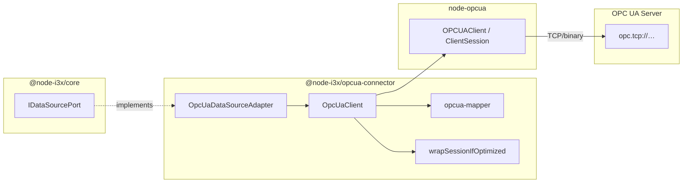

# @node-i3x/opcua-connector

[](https://nodejs.org)
[](https://www.typescriptlang.org)
[](../../LICENSE)
[](https://sterfive.com)

> OPC UA client adapter — implements `IDataSourcePort` using [node-opcua](https://github.com/node-opcua/node-opcua) for remote TCP/binary transport.

This package is the **outbound adapter** in the [hexagonal architecture](https://en.wikipedia.org/wiki/Hexagonal_architecture_(software)) of **node-i3x**. It connects to any OPC UA server over `opc.tcp://`, browses the address space, and exposes it through the `IDataSourcePort` interface defined in `@node-i3x/core`.

---

## Installation

```bash
npm install @node-i3x/opcua-connector
```

> [!NOTE]
> This package is published on the private **@sterfive** npm registry at `npm-registry.sterfive.fr`.

## Usage

```typescript
import {
  OpcUaClient,
  OpcUaDataSourceAdapter,
} from '@node-i3x/opcua-connector';

// 1. Create the low-level OPC UA client
const client = new OpcUaClient({
  endpointUrl: 'opc.tcp://localhost:4840',
  securityMode: 'None',
}, logger);

// 2. Wrap it as an IDataSourcePort
const dataSource = new OpcUaDataSourceAdapter(client, logger);

// 3. Connect — establishes TCP session + caches namespace array
await dataSource.connect();

// 4. Use through core services (ModelService, ValueService, …)
```

### Client Options

| Option | Type | Default | Description |
|---|---|---|---|
| `endpointUrl` | `string` | *(required)* | OPC UA server endpoint (`opc.tcp://…`) |
| `securityMode` | `'None' \| 'Sign' \| 'SignAndEncrypt'` | `'None'` | Message security mode |
| `applicationName` | `string` | `'node-i3x'` | Application name sent to the server |
| `optimizedClient` | `'auto' \| 'disabled'` | `'auto'` | Use `@sterfive/opcua-optimized-client` if installed |
| `browseStrategy` | `'parallel' \| 'browseAll'` | `'parallel'` | BFS browse strategy (parallel is ~18× faster) |

## Features

- 🌳 **Browse tree** — BFS discovery of the Objects folder with configurable parallel or serial strategy
- 📖 **Batch read / write** — single-value and multi-value reads with automatic array coercion
- 📜 **History** — `ReadRawModifiedDetails` history reads mapped to domain `SourceHistoricalValue`
- ⚡ **Method calls** — invoke OPC UA methods with automatic `Variant` wrapping
- 🔔 **Monitored subscriptions** — `createSubscription2` + `monitor()` with per-item data-change callbacks and debouncing
- 🔄 **Auto-reconnect** — exponential backoff with keep-alive session management
- 📦 **Namespace-URI mapping** — resolves volatile namespace indices to stable URIs for deterministic i3X element IDs

## Architecture



## Optional: Optimized Client

For large address spaces or high-throughput scenarios, install the optional [`@sterfive/opcua-optimized-client`](https://support.sterfive.com) package:

```bash
npm install @sterfive/opcua-optimized-client
```

When present and `optimizedClient` is set to `'auto'` (the default), the client session is transparently wrapped with `ClientSessionOptimized`, which adds:

- ✅ Auto-splitting of large `read` / `write` / `browse` requests to respect server operation limits
- ✅ Batch coalescing — combines multiple small operations into single transactions
- ✅ Queued re-entrance protection
- ✅ Automatic `browseNext` continuation-point handling
- ✅ Hold-and-resume during network disconnections

No code changes needed — the optimized session is a drop-in replacement.

## Key Exports

| Export | Kind | Description |
|---|---|---|
| `OpcUaClient` | Class | Low-level OPC UA client wrapping `node-opcua` |
| `OpcUaDataSourceAdapter` | Class | `IDataSourcePort` implementation delegating to `OpcUaClient` |
| `OpcUaClientOptions` | Type | Configuration interface for `OpcUaClient` |
| `qualifiedNameToNsu` | Function | Converts a `QualifiedName` to its `nsu=<URI>:<Name>` form |
| `wrapSessionIfOptimized` | Function | Wraps a `ClientSession` with the optimized client if available |

## Dependencies

| Package | Purpose |
|---|---|
| `@node-i3x/core` | Domain models, ports, services |
| `node-opcua` | OPC UA protocol stack |
| `node-opcua-client` | OPC UA client classes |

## License

This package is dual-licensed:

- **[AGPL-3.0-or-later](../../LICENSE)** — open-source use
- **[Sterfive Commercial License](https://sterfive.com)** — proprietary / commercial use

© [Sterfive](https://sterfive.com)
