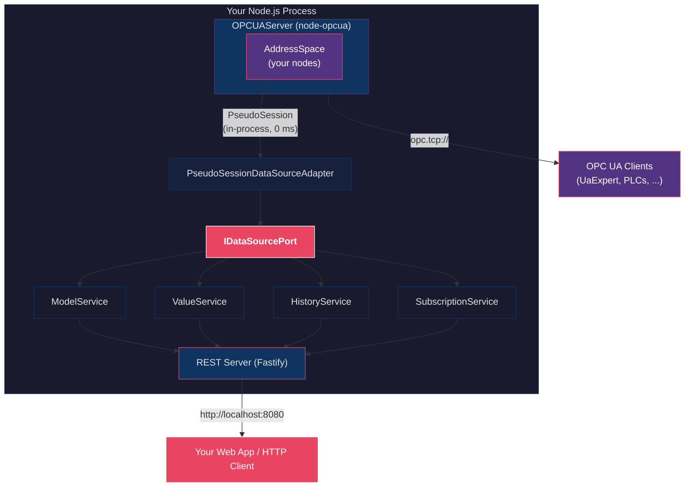

# Tutorial: Embedding an i3X REST API Inside Your OPC UA Server

> **A step-by-step, literate-programming guide to running OPC UA + i3X REST
> in a single Node.js process using `@node-i3x/pseudo-session-connector`.**

---

## Why embed?

Most OPC UA integrations look like this:

```
  OPC UA Server  <--- TCP/binary --->  OPC UA Client  --->  REST API
       (PLC)            ~5 ms               (bridge)
```

Every REST request crosses the network **twice**: once into the OPC UA client,
and once back out to the HTTP consumer. Serialisation, TLS handshakes, TCP
round-trips -- it all adds up.

With the **pseudo-session connector**, the entire stack runs **in one process**:

```
  OPC UA Server + i3X REST API   (same process, same memory)
       |
  AddressSpace  <--- PseudoSession --->  i3X domain services
       |                 0 ms                    |
       v                                         v
  opc.tcp://...                          http://localhost:8080/v1/...
```

Your existing OPC UA clients still connect normally over `opc.tcp://`. But now
you **also** have a fully compliant REST API, powered by the same AddressSpace,
at microsecond latency.

---

## Prerequisites

```bash
npm install @node-i3x/core
npm install @node-i3x/pseudo-session-connector
npm install @node-i3x/rest-server
npm install node-opcua
```

All packages are ESM-only and require Node.js >= 20.

---

## Step 1 -- Create an OPC UA Server

Nothing special here -- this is standard `node-opcua`. Create a server with
a few sample variables:

```typescript
import {
  DataType,
  nodesets,
  OPCUAServer,
  Variant,
} from 'node-opcua';

const OPCUA_PORT = 4840;
const REST_PORT  = 8080;

async function createServer() {
  const server = new OPCUAServer({
    port: OPCUA_PORT,
    resourcePath: '/UA/MyServer',
    nodeset_filename: [nodesets.standard],
  });

  await server.initialize();
  const addressSpace = server.engine.addressSpace!;
  const ns = addressSpace.getOwnNamespace();

  // -- Create a machine with two variables ---------

  const machine = ns.addObject({
    organizedBy: addressSpace.rootFolder.objects,
    browseName: 'CoffeeMachine',
    displayName: 'Coffee Machine',
  });

  const temperature = ns.addVariable({
    componentOf: machine,
    browseName: 'Temperature',
    displayName: 'Brew Temperature (C)',
    dataType: DataType.Double,
    value: new Variant({
      dataType: DataType.Double,
      value: 93.5,
    }),
  });

  const shotCount = ns.addVariable({
    componentOf: machine,
    browseName: 'ShotCount',
    displayName: 'Shots Brewed',
    dataType: DataType.UInt32,
    value: new Variant({
      dataType: DataType.UInt32,
      value: 1042,
    }),
  });

  await server.start();
  console.log(
    `OPC UA server listening on opc.tcp://localhost:${OPCUA_PORT}`,
  );

  return { server, addressSpace, temperature, shotCount };
}
```

At this point you have a perfectly normal OPC UA server. Any UA client
(UaExpert, Prosys, etc.) can connect and browse it.

---

## Step 2 -- Connect i3X to the AddressSpace (3 lines)

This is where the magic happens. Instead of creating a TCP client that connects
back to our own server, we inject the `AddressSpace` reference directly:

```typescript
import {
  PseudoSessionDataSourceAdapter,
} from '@node-i3x/pseudo-session-connector';
import { consoleLogger } from '@node-i3x/core';

const logger = consoleLogger;

// This is ALL you need -- no network, no serialisation
const dataSource = new PseudoSessionDataSourceAdapter(
  addressSpace,
  logger,
);
await dataSource.connect();
```

`PseudoSessionDataSourceAdapter` implements `IDataSourcePort`, the same
interface that the remote OPC UA connector implements. From here on,
**every domain service works identically** -- the code doesn't know or care
whether data arrives over TCP or from in-process memory.

### What happens inside `connect()`?

1. Creates a `PseudoSession` from `node-opcua-address-space`
2. Reads the namespace array (`ns=0;i=2255`) to cache namespace URIs
3. Marks the adapter as connected

No TCP socket, no binary handshake, no TLS negotiation.

---

## Step 3 -- Wire Up Domain Services

The four domain services are framework-agnostic -- they accept any
`IDataSourcePort` and a logger:

```typescript
import {
  ModelService,
  ValueService,
  HistoryService,
  SubscriptionService,
} from '@node-i3x/core';

const modelService = new ModelService(dataSource, logger);
const valueService = new ValueService(
  dataSource, modelService, logger,
);
const historyService = new HistoryService(
  dataSource, modelService, logger,
);
const subscriptionService = new SubscriptionService(
  dataSource, modelService, logger,
);
```

### Pre-load the model (recommended)

Building the i3X model involves a BFS tree walk of the AddressSpace.
Pre-loading it at startup means the first REST request is instant:

```typescript
const model = await modelService.preloadModel();

console.log(`Model built:`);
console.log(`  ${model.nodesById.size} nodes`);
console.log(`  ${model.rootIds.length} roots`);
console.log(`  ${model.propertyToSource.size} properties`);
console.log(`  ${model.actionToMethod.size} actions`);
```

For the coffee machine above, this produces something like:

```
Model built:
  3 nodes
  1 roots
  2 properties
  0 actions
```

---

## Step 4 -- Start the REST Server

`createApp` builds a fully configured Fastify instance with all i3X
routes, middleware, CORS, and error handling:

```typescript
import { createApp } from '@node-i3x/rest-server';

const app = await createApp({
  dataSource,
  modelService,
  valueService,
  historyService,
  subscriptionService,
  logger,
});

await app.listen({ port: REST_PORT, host: '0.0.0.0' });

console.log(`i3X REST API ready at http://localhost:${REST_PORT}`);
```

That's it. You now have:

- `opc.tcp://localhost:4840` -- standard OPC UA binary endpoint
- `http://localhost:8080/v1/...` -- i3X Beta REST API

Both serve the **exact same data** from the **exact same AddressSpace**.

---

## Step 5 -- Try It

```bash
# Health check
curl http://localhost:8080/health
# {"status":"ok"}

# Server info
curl http://localhost:8080/v1/info
# {"success":true,"data":{"specVersion":"beta",...}}

# List namespaces
curl http://localhost:8080/v1/namespaces
# {"success":true,"data":[...]}

# List all objects (root assets)
curl "http://localhost:8080/v1/objects?root=true"
# {"success":true,"data":[{"elementId":"asset-...","name":"CoffeeMachine",...}]}

# Read current values
curl -X POST http://localhost:8080/v1/objects/value \
  -H "Content-Type: application/json" \
  -d '{"elementIds":["property-..."]}'
```

---

## Step 6 -- Real-Time Subscriptions

The pseudo-session connector supports **event-based** subscriptions.
When a variable changes via `setValueFromSource()`, the i3X subscription
fires **immediately** -- no polling delay:

```typescript
// Simulate a value change in the OPC UA address space
import { DataType, Variant } from 'node-opcua';

setInterval(() => {
  const temp = 90 + Math.random() * 10;
  temperature.setValueFromSource(
    new Variant({ dataType: DataType.Double, value: temp }),
  );
}, 1000);
```

On the REST side, clients consume changes via Server-Sent Events:

```bash
# SSE stream -- real-time updates as they happen
curl -N -X POST http://localhost:8080/v1/subscriptions \
  -H "Content-Type: application/json" \
  -d '{"elementIds":["property-..."]}'

# Returns a subscriptionId, then:
curl -N -X POST http://localhost:8080/v1/subscriptions/stream \
  -H "Content-Type: application/json" \
  -d '{"subscriptionId":"..."}'
```

### How event-based subscriptions work

```
  Your code calls:
    temperature.setValueFromSource(new Variant(...))

        |
        v
  node-opcua fires 'value_changed' event on UAVariable

        |
        v
  AddressSpaceMonitoredSubscription catches it

        |
        v
  DataChangeCallback fires -> SubscriptionService debounces

        |
        v
  SSE event pushed to HTTP client (< 1ms total)
```

No polling interval, no wasted CPU cycles, no missed changes.

---

## Step 7 -- Graceful Shutdown

```typescript
async function shutdown() {
  console.log('Shutting down...');
  await app.close();                    // stop HTTP server
  await subscriptionService.close();    // clean up subscriptions
  await dataSource.disconnect();        // release PseudoSession
  await server.shutdown(500);           // stop OPC UA server
  process.exit(0);
}

process.on('SIGINT', shutdown);
process.on('SIGTERM', shutdown);
```

---

## Complete Example

Here is the full working program, all in one file:

```typescript
// embedded-i3x.ts
// Run with: npx tsx embedded-i3x.ts

import {
  consoleLogger,
  HistoryService,
  ModelService,
  SubscriptionService,
  ValueService,
} from '@node-i3x/core';
import {
  PseudoSessionDataSourceAdapter,
} from '@node-i3x/pseudo-session-connector';
import { createApp } from '@node-i3x/rest-server';
import {
  DataType,
  nodesets,
  OPCUAServer,
  Variant,
} from 'node-opcua';

const OPCUA_PORT = 4840;
const REST_PORT  = 8080;

async function main() {
  const logger = consoleLogger;

  // ---- 1. Create OPC UA server with sample nodes ----------

  const server = new OPCUAServer({
    port: OPCUA_PORT,
    resourcePath: '/UA/MyServer',
    nodeset_filename: [nodesets.standard],
  });
  await server.initialize();

  const addressSpace = server.engine.addressSpace!;
  const ns = addressSpace.getOwnNamespace();

  const machine = ns.addObject({
    organizedBy: addressSpace.rootFolder.objects,
    browseName: 'CoffeeMachine',
    displayName: 'Coffee Machine',
  });

  const temperature = ns.addVariable({
    componentOf: machine,
    browseName: 'Temperature',
    dataType: DataType.Double,
    value: new Variant({
      dataType: DataType.Double,
      value: 93.5,
    }),
  });

  ns.addVariable({
    componentOf: machine,
    browseName: 'ShotCount',
    dataType: DataType.UInt32,
    value: new Variant({
      dataType: DataType.UInt32,
      value: 1042,
    }),
  });

  await server.start();
  console.log(
    `OPC UA:  opc.tcp://localhost:${OPCUA_PORT}/UA/MyServer`,
  );

  // ---- 2. Connect i3X to the AddressSpace -----------------

  const dataSource = new PseudoSessionDataSourceAdapter(
    addressSpace,
    logger,
  );
  await dataSource.connect();

  // ---- 3. Wire domain services ----------------------------

  const modelService = new ModelService(dataSource, logger);
  const valueService = new ValueService(
    dataSource, modelService, logger,
  );
  const historyService = new HistoryService(
    dataSource, modelService, logger,
  );
  const subscriptionService = new SubscriptionService(
    dataSource, modelService, logger,
  );

  // Pre-load the model
  const model = await modelService.preloadModel();
  console.log(
    `Model:   ${model.nodesById.size} nodes, ` +
    `${model.rootIds.length} roots, ` +
    `${model.propertyToSource.size} properties`,
  );

  // ---- 4. Start REST server -------------------------------

  const app = await createApp({
    dataSource,
    modelService,
    valueService,
    historyService,
    subscriptionService,
    logger,
  });
  await app.listen({ port: REST_PORT, host: '0.0.0.0' });
  console.log(`REST:    http://localhost:${REST_PORT}/v1/info`);

  // ---- 5. Simulate live data changes ----------------------

  setInterval(() => {
    const temp = 90 + Math.random() * 10;
    temperature.setValueFromSource(
      new Variant({ dataType: DataType.Double, value: temp }),
    );
  }, 1000);

  console.log('\nReady. Press Ctrl+C to stop.\n');

  // ---- 6. Graceful shutdown -------------------------------

  const shutdown = async () => {
    console.log('\nShutting down...');
    await app.close();
    await subscriptionService.close();
    await dataSource.disconnect();
    await server.shutdown(500);
    process.exit(0);
  };
  process.on('SIGINT', shutdown);
  process.on('SIGTERM', shutdown);
}

main().catch((err) => {
  console.error('Fatal:', err);
  process.exit(1);
});
```

---

## When to Use Embedded vs Remote

| | Embedded (pseudo-session) | Remote (opcua-connector) |
|---|---|---|
| **Use when** | You own the OPC UA server code | Connecting to 3rd-party PLCs |
| **Latency** | Microseconds (in-process) | Milliseconds (TCP) |
| **Network** | None required | Requires TCP connectivity |
| **Deployment** | Single process | Separate processes possible |
| **Security** | In-process trust | OPC UA security policies |
| **Language** | Must be Node.js / TypeScript | Server can be any language |
| **Scaling** | Vertical only | Horizontal possible |

> **Tip:** You can run **both connectors simultaneously** in different processes
> against the same OPC UA server. The remote connector connects via `opc.tcp://`
> while the embedded connector talks directly to the AddressSpace.

---

## Architecture

<!-- mermaid-img -->
<p align="center">
  
</p>

<details><summary>Diagram source (mermaid)</summary>



</details>

---

## License

This tutorial and the `@node-i3x/pseudo-session-connector` package are
dual-licensed:

- **[AGPL-3.0-or-later](https://www.gnu.org/licenses/agpl-3.0.html)** --
  free for open-source use
- **[Sterfive Commercial License](https://sterfive.com)** -- proprietary use

Contact [contact@sterfive.com](mailto:contact@sterfive.com) for commercial
licensing.
