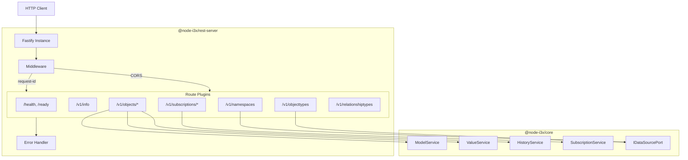

# @node-i3x/rest-server

[](https://nodejs.org)
[](https://www.typescriptlang.org)
[](https://fastify.dev)
[](../../LICENSE)

> Fastify REST routes implementing the [i3X Beta API](https://i3x-spec.example.com) specification.

This package is the **inbound adapter** in the [hexagonal architecture](https://en.wikipedia.org/wiki/Hexagonal_architecture_(software)) of **node-i3x**. It exposes all domain services (`ModelService`, `ValueService`, `HistoryService`, `SubscriptionService`) as a standards-compliant REST API, including real-time Server-Sent Events (SSE) streaming.

---

## Installation

```bash
npm install @node-i3x/rest-server
```

> [!NOTE]
> This package is published on the private **@sterfive** npm registry at `npm-registry.sterfive.fr`.

## Usage

```typescript
import { createApp } from '@node-i3x/rest-server';

const app = await createApp({
  dataSource,
  modelService,
  valueService,
  historyService,
  subscriptionService,
  logger,
});

await app.listen({ port: 8080 });
```

The `createApp` factory wires all middleware, error handling, and route plugins onto a Fastify instance. The returned `app` is a standard `FastifyInstance` ready to listen.

### Dependency Injection

`createApp` expects a `RestServerDeps` object containing all core services. This follows the **ports & adapters** pattern — the REST layer never imports OPC UA code directly:

```typescript
interface RestServerDeps {
  dataSource: IDataSourcePort;
  modelService: ModelService;
  valueService: ValueService;
  historyService: HistoryService;
  subscriptionService: SubscriptionService;
  logger: ILogger;
}
```

## Endpoints

### Health & Info

| Method | Path | Description |
|---|---|---|
| `GET` | `/health` | Liveness probe — always returns `{ status: 'ok' }` |
| `GET` | `/ready` | Readiness probe — checks data-source connectivity |
| `GET` | `/v1/info` | Server capabilities, spec version, and server info |

### Namespaces

| Method | Path | Description |
|---|---|---|
| `GET` | `/v1/namespaces` | List all OPC UA namespaces (URI + display name) |

### Object Types

| Method | Path | Description |
|---|---|---|
| `GET` | `/v1/objecttypes` | List object types, optionally filtered by `?namespaceUri=` |
| `POST` | `/v1/objecttypes/query` | Query object types *(501 — not yet implemented)* |

### Relationship Types

| Method | Path | Description |
|---|---|---|
| `GET` | `/v1/relationshiptypes` | List relationship types *(501 — not yet implemented)* |
| `POST` | `/v1/relationshiptypes/query` | Query relationship types *(501 — not yet implemented)* |

### Objects

| Method | Path | Description |
|---|---|---|
| `GET` | `/v1/objects` | List all objects; filter with `?root=true` or `?typeElementId=` |
| `POST` | `/v1/objects/list` | Bulk lookup objects by element IDs |
| `POST` | `/v1/objects/related` | Get related objects (children + parent) for given element IDs |
| `POST` | `/v1/objects/value` | Bulk read current values (with `maxDepth` expansion) |
| `POST` | `/v1/objects/history` | Bulk read historical values within a time range |
| `GET` | `/v1/objects/:elementId/history` | Get history for a single element *(501 — not yet implemented)* |
| `PUT` | `/v1/objects/:elementId/history` | Write history for a single element *(501 — not yet implemented)* |
| `PUT` | `/v1/objects/:elementId/value` | Write a value to a single element |

### Subscriptions

| Method | Path | Description |
|---|---|---|
| `POST` | `/v1/subscriptions` | Create a new subscription |
| `POST` | `/v1/subscriptions/register` | Register element IDs to monitor on a subscription |
| `POST` | `/v1/subscriptions/unregister` | Unregister element IDs from a subscription |
| `POST` | `/v1/subscriptions/sync` | Poll for data-change updates (acknowledge + receive) |
| `POST` | `/v1/subscriptions/stream` | SSE stream — real-time data-change events with keepalive |
| `POST` | `/v1/subscriptions/delete` | Delete one or more subscriptions |
| `POST` | `/v1/subscriptions/list` | List subscription details |

## Features

- 🌐 **CORS support** — enabled via `@fastify/cors` with `origin: true`
- 🆔 **Request ID middleware** — assigns unique request IDs for traceability
- ⚠️ **Structured error responses** — consistent `{ success: false, error: { code, message } }` envelope
- 📡 **Server-Sent Events** — `/v1/subscriptions/stream` uses Fastify response hijacking for true SSE with keepalive comments
- 📋 **Bulk operations** — list, value, history, and related endpoints accept arrays of element IDs
- 🔌 **Plugin architecture** — each route group is a self-contained Fastify plugin
- 🏗️ **OpenAPI-aligned** — follows the i3X Beta specification response envelope

## Architecture



## Key Exports

| Export | Kind | Description |
|---|---|---|
| `createApp` | Function | Factory that builds and returns a configured `FastifyInstance` |
| `RestServerDeps` | Type | Dependency injection interface for `createApp` |

## Dependencies

| Package | Version | Purpose |
|---|---|---|
| `@node-i3x/core` | `*` | Domain models, ports, and service interfaces |
| `fastify` | `^5.0.0` | HTTP framework |
| `@fastify/cors` | `^11.0.0` | Cross-Origin Resource Sharing |
| `fastify-plugin` | `^5.0.0` | Fastify plugin helper for encapsulation |

## License

This package is dual-licensed:

- **[AGPL-3.0-or-later](../../LICENSE)** — open-source use
- **[Sterfive Commercial License](https://sterfive.com)** — proprietary / commercial use

© [Sterfive](https://sterfive.com)
